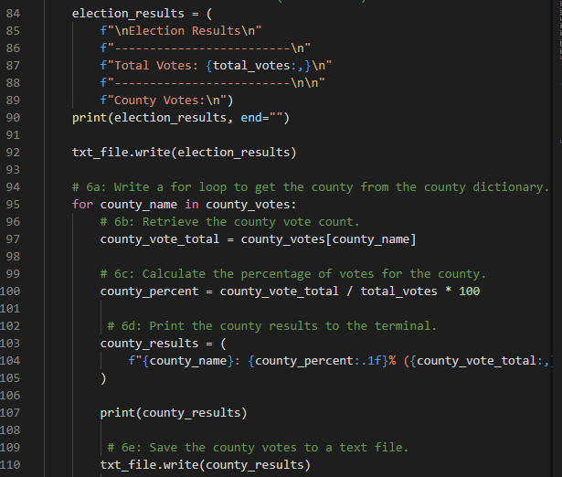

# Election_Analysis

## Project Overview
The Colorado Board of Elections has requested the following tasks be done to assist in conducting an audit of a recent local congressional election:

1. Calculate the total number of votes cast
2. Get complete list of candidates who received votes
3. Calculate the total number of votes each candidate won.
4. Calculate the percentage of votes each candidate won.
5. Determine the winner of the election based on popular vote.

## Resources
Data Source: election_resuts.csv
Software: Python 3.7.9, Visual Studio Code 1.52.1

## Summary
The analysis of the election data show:
- There were 369,711 total votes cast
- The Candidates were:
  - Chales Casper Stockham
  - Diana DeGette
  - Raymon Anthony Doane
- The results for each candidate were:
  - Charles Caspere Stockham received 85,213 votes and 23.0% of the total votes cast.
  - Diana DeGette received 272,892 votes and 73.8% of the total votes cast.
  - Raymon Anthony Doan received 11,606 votes and 3.1% of the total votes cast.
- The winner of the election was:
  - Diana DeGette who received 272,892 votes and 73.8% of the total votes cast.
  
## Challenge Overview
The Colorado Board of Elections has asked to include the following information about the counties in this election to the audtin:

1. Get a list of the counties that voted in this election
2. Calculate the voter turnout for each county in the election
3. Calculate the percentage of the total vote that came from each county
4. Determine which county had the largest voter turnout

## Challenge Summary
The analysis of the counties data show:
- The Counties that voted in this election were:
  - Jefferson
  - Denver
  - Arapahoe
- The turnout for each county was:
  - Jefferson had 10.5% of the total vote with 38,855 votes.
  - Denver had 82.8% of the total vote with 306,055 votes.
  - Arapahoe had 6.7% of the total vote with 24,801 votes.
- The county with the largest voter turnout was:
  - Denver with 82.8% of the total vote and 306,055 votes.
  
## Use in Other Elections
The pthyon script used to analyze the election data and write the results to the text file could easily be used again to audit future elections or other existing elections.  Below is the section of the code that in part tracks additional candidates as it finds them.

A similar section of code to this that tracks the counties and adds additional ones as it finds them follows the same structure.  Because the script is designed to track candidate names and counties as it loops through the election data, no changes to the script at all would be necessary to accomodate elections with differing numbers of candidates or that include varying number of counties.

Other variations in the election format may necessitate minimal edits to the code to accomodate.  For instance, an election that takes place all within one county would likely not have the county information included in the raw data is it was with the CSV for this election.  If only the ballot number and the candidate being voted for on that ballot are included in the data, the index number in brackets in the first line of code below would need to be changed from 2 to 1 to accomodate the candidate's name being in a different position within the source data

Additionally, the second line of code from this excerpt, which currently references the county name from the original source data, could be commented so it would not run as there would not be a county name in the hypothetical discussed.  Other lines of code in the script which collect information on the county turnout could also be commented out in this hypothetical.  Commenting out the lines of code that analyze county data in this scenario is preferable to simply deleting the code, so that in future election audits that would include county data, those lines could easily reinstated by undoing the commenting.

Another potential modification could be made to the code to accomodate elections that occur over various cities, districts, or parishes, rather than counties.  In order to collect date by city, etc., the word "county" or "counties" used in various strings and variable names in the below excerpts of code could simply be substituted with city, etc.

